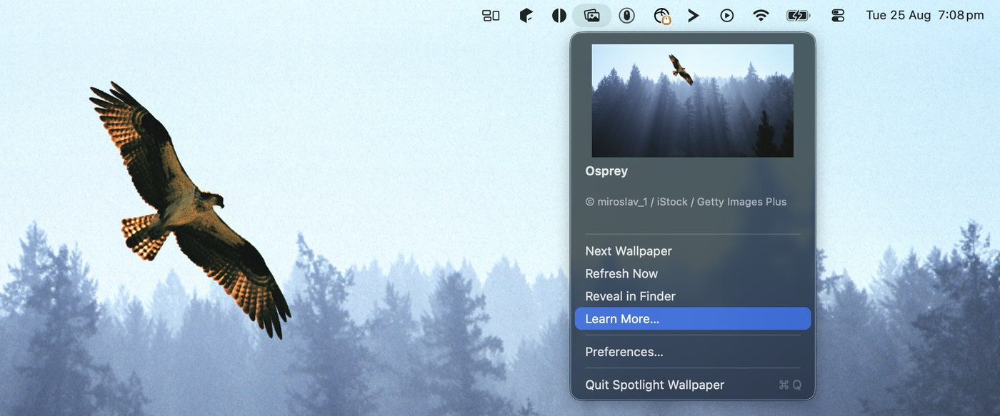

# spotlight-wallpaper

A tiny macOS menu bar app that brings **Windows Spotlight** to your Mac: the same
curated, rotating daily desktop images Windows shows you — including the "learn
more about this picture" info (title + photographer/copyright).

It's not a Bing Wallpaper clone or a random-Unsplash-photo app — it calls the same
public Spotlight image feed Windows itself uses, so you get the exact same photos.

<p align="center"></p>

## Features

- Fetches the real Windows Spotlight daily image batch (up to 4K).
- Automatically sets it as your desktop wallpaper, across every connected display.
- Rotates through the day's images on a configurable interval (every 3h / 6h / 12h / once a day).
- Menu bar popover shows the current image's **title** and **copyright/description** —
  the "learn more" equivalent — plus a one-click *Next Wallpaper*, *Refresh Now*,
  *Reveal in Finder*, and a *Learn More* button that searches the title on Bing
  (Spotlight's own "learn more" links do the same thing under the hood).
- Keeps a small local history of recently shown images with their info, not just the current one.
- No Dock icon, no window chrome — just a menu bar item.

## Install

```sh
brew install --cask maxgoodwin/spotlight-wallpaper/spotlight-wallpaper
```

This installs **Spotlight Wallpaper.app** to `/Applications` — it's a real, Spotlight-searchable
app (⌘Space, type "Spotlight Wallpaper"), not just a CLI binary. Launch it once, then turn on
**Launch at login** in Preferences… to have it start automatically from then on.

## Usage

Click the menu bar icon (a photo-stack glyph) to see the current wallpaper's info
and actions. Open **Preferences…** to change the rotation interval, force a
landscape/portrait image, override the locale used to fetch images (Spotlight's
selection varies a bit by region), or turn on **Launch at login**.

CLI flags (useful for scripting/debugging) — run the binary inside the app bundle directly:

```sh
"/Applications/Spotlight Wallpaper.app/Contents/MacOS/spotlight-wallpaper" --fetch-once   # print today's images' titles/copyright/URLs and exit
"/Applications/Spotlight Wallpaper.app/Contents/MacOS/spotlight-wallpaper" --version
"/Applications/Spotlight Wallpaper.app/Contents/MacOS/spotlight-wallpaper" --help
```

## How it works

Windows Spotlight's image feed is a plain HTTPS JSON API
(`fd.api.iris.microsoft.com/v4/api/selection`, with a `arc.msn.com/v3/...` fallback)
— it isn't actually gated to Windows, just undocumented. This app calls it directly,
downloads the images to `~/Library/Application Support/spotlight-wallpaper/`, and
uses `NSWorkspace` to set them as the desktop picture.

Endpoint and JSON field names were identified by reading the parsing logic in
[ORelio/Spotlight-Downloader](https://github.com/ORelio/Spotlight-Downloader)
(CDDL-1.0) — no code from that project is included here, just the API shape;
credit and thanks to that project for documenting it.

This project is **not affiliated with or endorsed by Microsoft**. The Spotlight API
is undocumented and may change or stop working without notice.

## Building from source

```sh
git clone https://github.com/maxgoodwin/spotlight-wallpaper
cd spotlight-wallpaper
swift build -c release
.build/release/spotlight-wallpaper
```

Requires macOS 14+ and Xcode 15+ (or the matching Command Line Tools) for Swift 5.9+.

To build the actual `.app` bundle (matching what the cask installs) instead of the bare
binary above, run `scripts/build-app.sh` — it produces `.build/Spotlight Wallpaper.app`
(pass `--zip` to also produce a zip for a release). Regenerate the icon with
`scripts/make-icon.sh` if you change the glyph in `scripts/render-icon.swift`.

## Contributing

Issues and PRs welcome — this is a small, single-purpose tool, so please keep
changes focused. Run `swift build` before opening a PR; CI runs the same build
plus a couple of smoke tests on macOS.

## License

[GPL-3.0-or-later](LICENSE)
